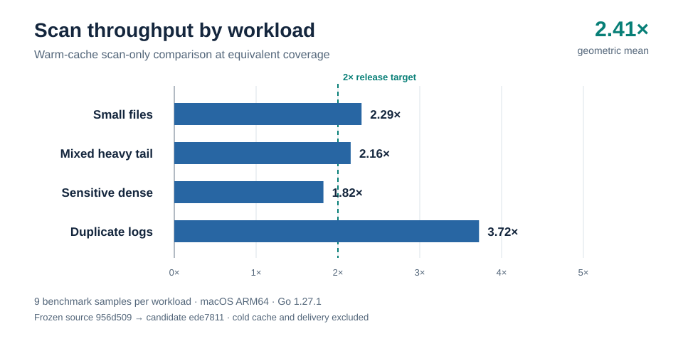
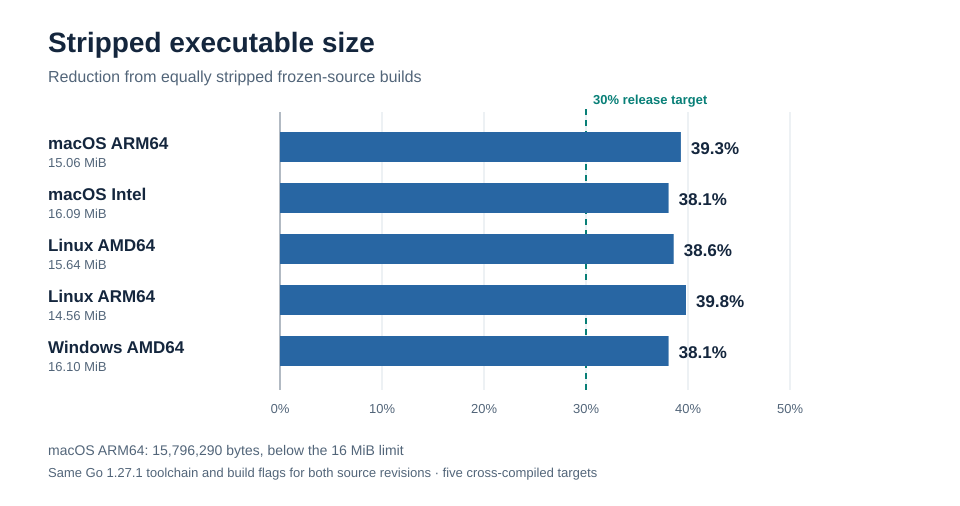

# Safnari: File and System Information Gatherer

Safnari is a versatile tool for gathering file and system information from a host
machine. It scans user-defined paths, collects rich metadata about files, and
retrieves system details such as running processes. Safnari supports numerous
configuration flags for filtering, hashing, and output control.

[Performance dashboard](https://provisioinsights.github.io/Safnari/) tracks the
latest benchmark run published by the GitHub Performance workflow.

## Measured release performance

The schema-v3 candidate reached a **2.406× geometric-mean throughput gain** across four
representative workloads against the frozen pre-optimization source. The paired, controlled
macOS ARM64 run used Go 1.27.1, equivalent detection coverage, and nine benchmark samples per
workload. Its process tail-latency and peak-memory gates passed as well.



All five stripped release targets were at least 38% smaller than equally stripped baseline
builds. The macOS ARM64 executable measured 15,796,290 bytes, below the 16 MiB release limit.



These are warm-cache, scan-only measurements; cold-cache behavior and managed-delivery overhead
are not established by these charts. The Go 1.27.1 toolchain change alone measured 0.982×
throughput against Go 1.26.8. An earlier controlled run measured 3.146× on the same scanner
code; both results are retained. See the [RC3 raw evidence](artifacts/bench/rc3-controlled-20260923/),
the [RC3 workflow run](https://github.com/ProvisioInsights/Safnari/actions/runs/35880325070),
and the [remaining release gates](docs/release-gates-v3.md).

## Features

- Gather host information such as OS details, installed patches, and hostname
- List running processes and their details (PID, name, memory usage, etc.)
- Scan files across specified paths or all drives
- Calculate file hashes (SHA-256 by default; MD5, SHA-1, and BLAKE3 on request)
- Extract lightweight metadata from images (EXIF) and DOCX documents
- Detect sensitive data patterns such as emails, credit cards (with Luhn validation), AWS keys, JWT
  tokens, street addresses, IBANs, UK National Insurance numbers, EU VAT IDs, India Aadhaar numbers,
  China resident IDs, and user-defined regexes via the `--custom-patterns` JSON flag. Users can scan
  only selected types with `--include-sensitive-data-types` or skip some with
  `--exclude-sensitive-data-types`.
- Search for arbitrary terms with `--search` (matches are reported as `search_hits` in the output).
- Redact sensitive matches in output with `--redact-sensitive` (mask or hash).
- Toggle system information gathering, file metadata scanning, sensitive data detection, and
  process enumeration independently via CLI flags
- Output schema v3 NDJSON records with stable scan and event identity

## Installation

### Build from Source

```sh
git clone https://github.com/ProvisioInsights/Safnari.git
cd Safnari
make build
```

The compiled binary will be located in the `bin` directory.
Use `make build-release` for a stripped release executable and a matching unstripped
diagnostic build under `bin/debug/`.
Use `make build-release-all VERSION=<tag>` to build all five release targets with an embedded
version. Build outputs stay in `bin/`.

Safnari uses Go 1.27.1 and its stable JSON-v2 encoder for release builds. macOS builds require
macOS 13 Ventura or later.

Release builds embed the supplied tag. For example:

```sh
make build-release VERSION=safnari-20260923a
```

To cross-compile for other platforms, set `GOOS` and `GOARCH`:

```sh
# macOS Apple Silicon
GOOS=darwin GOARCH=arm64 make build

# Linux ARM64
GOOS=linux GOARCH=arm64 make build
```

You can build binaries for all supported targets at once with:

```sh
make build-all
```

To include runtime tracing for debugging and performance analysis, build with
the `trace` tag:

```sh
cd src
go build -tags trace -o ../bin/safnari-trace ./cmd
```

Trace-enabled builds record code-level tasks and regions to `trace.out`. Use
`go tool trace trace.out` to inspect execution timing and behavior.

For low-overhead tracing in any build, enable the in-memory flight recorder with
`--trace-flight`. Safnari will dump the recent trace window to `trace-flight.out`
at exit or on interrupt. Use `--trace-flight-max-bytes` and `--trace-flight-min-age`
to tune the capture window.

### Download Pre-Compiled Binary

Check the [releases page](https://github.com/ProvisioInsights/Safnari/releases) for
binaries for your operating system. Releases use the `safnari-<date><letter>` naming
scheme, where `date` is in `YYYYMMDD` format and `letter` increments if multiple releases
occur on the same day. Schema-v3 release candidates have an `-rcN` suffix and are prereleases
while managed-delivery validation and device pilots remain open.

## Usage

Run the binary with `-h` to see all available options. By default Safnari scans
the current working directory for file inventory only, using a concurrency level
equal to the number of logical CPUs. Sensitive content scanning, process
enumeration, system information collection, and release update checks are
disabled unless explicitly requested. Results are written to a timestamped file named
`safnari-<human-readable>-<unix>.ndjson`.

If only `--exclude-sensitive-data-types` is supplied, Safnari scans all built-in patterns except
those excluded. When both include and exclude lists are provided, the exclusion list removes types
from the inclusion list. Custom regex patterns can be added with `--custom-patterns` using a JSON
object mapping names to regexes. Use `--sensitive-match-mode first` to retain only the first match
per sensitive type in each file; those records are marked with `sensitive_data_truncated` and a
collection warning so presence-only scans are explicit.

### Default flags

Running Safnari without any flags applies these defaults:

- `--path`: `.`
- `--all-drives`: `false`
- `--scan-files`: `true`
- `--scan-sensitive`: `false`
- `--scan-processes`: `false`
- `--collect-system-info`: `false`
- `--check-updates`: `false`
- `--format`: `json`
- `--output`: `safnari-<timestamp>-<unix>.ndjson`
- `--concurrency`: number of logical CPUs (effective value adjusted by `--nice` unless
  `--concurrency` is set)
- `--nice`: `medium`
- `--hashes`: `sha256`
- `--search`: none
- `--include`: none
- `--exclude`: none
- `--max-file-size`: `10485760`
- `--content-scan-max-bytes`: `10485760` (`0` means unlimited only when sensitive scanning is disabled)
- `--max-output-file-size`: `104857600`
- `--log-level`: `info`
- `--max-io-per-second`: `1000` (set to `0` to disable throttling)
- `--config`: none
- `--extended-process-info`: `false`
- `--include-sensitive-data-types`: none (all built-in and custom patterns are used when `--scan-sensitive` is enabled without an include list)
- `--exclude-sensitive-data-types`: none
- `--fuzzy-hash`: `false`
- `--fuzzy-algorithms`: none (defaults to `tlsh` when fuzzy hashing enabled)
- `--fuzzy-min-size`: `256`
- `--fuzzy-max-size`: `20971520`
- `--delta-scan`: `false`
- `--delta-cache-mode`: `chunk`
- `--delta-cache-dir`: `${os.UserCacheDir()}/safnari/delta-cache`
- `--delta-cache-max-bytes`: `1073741824`
- `--last-scan-file`: `.safnari_last_scan`
- `--last-scan`: none
- `--skip-count`: `true`
- `--sensitive-match-mode`: `all`
- `--redact-sensitive`: `mask` (use `none` to disable)
- `--collect-xattrs`: `true`
- `--xattr-max-value-size`: `1024`
- `--collect-acl`: `true`
- `--collect-scheduled-tasks`: `true`
- `--collect-users`: `true`
- `--collect-groups`: `true`
- `--collect-admins`: `true`
- `--scan-ads`: `false`
- `--auto-tune`: `true`
- `--auto-tune-interval`: `5s`
- `--auto-tune-target-cpu`: `60`
- `--auto-tune-runtime-metrics`: `true`
- `--auto-tune-target-runq`: `1.0`
- `--auto-tune-target-latency-ms`: `25`
- `--perf-profile`: `adaptive`
- `--sensitive-engine`: `auto`
- `--sensitive-longtail`: `sampled`
- `--sensitive-window-bytes`: `4096`
- `--stream-chunk-size`: `262144`
- `--stream-overlap-bytes`: `512`
- `--json-layout`: `ndjson`
- `--diag-slow-scan-threshold`: `0`
- `--diag-dir`: `.`
- `--diag-goroutine-leak`: `false`
- `--otel-endpoint`: none (enable OTLP/HTTP log export)
- `--otel-headers`: none
- `--otel-service-name`: `safnari`
- `--otel-timeout`: `5s`
- `--spool-dir`: user cache `safnari/spool`
- `--device-id`: generated installation ID unless externally provisioned
- `--replay-only`: `false`
- `--trace-flight`: `false`
- `--trace-flight-file`: `trace-flight.out`
- `--trace-flight-max-bytes`: `0`
- `--trace-flight-min-age`: `0`

Performance and optimization workflows are available through:

```sh
make bench-ultra
make bench-gate
make bench-gate BASELINE=artifacts/bench/<before-dir> CANDIDATE=artifacts/bench/<after-dir>
make bench-compare BASELINE=artifacts/bench/<before-dir> CANDIDATE=artifacts/bench/<after-dir>
make profile-generate
make build-pgo-ultra
```

`make bench-ultra` now captures synthetic, small-files, mixed, mixed-heavy-tail,
sensitive-dense, duplicate-log, and delta second-run samples into a timestamped
artifact directory under `artifacts/bench/`. Use `make bench-compare` against
two artifact directories to generate a `benchstat` before/after report. When
both `BASELINE` and `CANDIDATE` are supplied, `make bench-gate` switches into
artifact-compare mode and enforces the before/after thresholds.

In GitHub Actions, pull requests and pushes upload benchmark artifacts. The historical
ultra gate is informational for schema v3. The separate numeric gate and outstanding
release checks are described in [release-gates-v3.md](docs/release-gates-v3.md).

```sh
./bin/safnari-$(go env GOOS)-$(go env GOARCH) --path /home/user --hashes sha256 --search "password"
```

This will scan `/home/user`, compute SHA-256 hashes, search for the term
`password`, and write results to a file such as
`safnari-20240130-150405-1706625005.ndjson` unless an alternate output filename
is provided.

Search results are included as a `search_hits` map where each term maps to the number of matches
found in that file. When content inspection is capped by `--content-scan-max-bytes`, file records
also include `content_scan_bytes`, `content_scan_truncated`, and `collection_warnings`.

Delta scans default to `--delta-cache-mode mtime`. Chunk caching remains available explicitly.

Safnari writes schema v3 NDJSON. Each record has `device_id`, `scan_id`, `sequence`, `event_id`,
`observed_at`, `scanner_version`, and `policy_digest` as well as the record type and payload.
`scan_start` and `scan_complete` bracket the existing system, process, file, and metrics records.
See the [v3 migration guide](docs/migration-v3.md) before replacing a v2 deployment.

Metrics include start/end timestamps, total files discovered, files scanned, files written to the
output, and total running processes.

Use `--version` to print the embedded version. Safnari does not make outbound
release checks unless `--check-updates` is enabled.

### OTEL Export

When `--otel-endpoint` is set (or OTEL environment variables are enabled), Safnari queues
sanitized records durably and exports them over OTLP/HTTP Logs. Use `--replay-only` to drain a
pending spool without scanning. Receiver acceptance acknowledges a batch; consumers must
deduplicate by `event_id`. Export defaults exclude paths, filenames, raw matches, search terms,
command lines, and detailed metadata. HTTPS is required except for loopback development.

## Security Posture (Brief)

Safnari is a local CLI with no server listener. The primary security risks are
the sensitivity of scan outputs and the integrity of any future telemetry
exports. Output files are created with `0600` permissions by default, sensitive
matches are masked unless explicitly disabled, and Safnari skips its own
output, delta-scan, trace, and diagnostics artifacts while walking target
paths. For managed fleet or OTEL deployments, prefer authenticated and
encrypted export channels with data-minimization defaults (hashes/locators over
raw values).

CI layers `govulncheck`, CodeQL, Gitleaks, and Trivy on pull requests and pushes.
It builds all five targets and uploads stripped binaries, diagnostic builds, and SPDX SBOMs
as workflow artifacts. See the [changelog](docs/CHANGELOG.md) for release changes.

## Capability Matrix

The table below summarizes what Safnari collects by default across platforms. Optional features can be disabled with the listed flags.

| Capability | macOS | Linux | Windows | Request / Flag | Privilege |
| --- | --- | --- | --- | --- | --- |
| Baseline file inventory | Yes | Yes | Yes | `--scan-files` | User |
| Cryptographic hashes (MD5/SHA1/SHA256) | Yes | Yes | Yes | `--hashes` | User |
| Fuzzy hashing (TLSH) | Yes | Yes | Yes | `--fuzzy-hash`, `--fuzzy-algorithms`, size limits | User |
| File metadata (EXIF/DOCX) | Yes | Yes | Yes | `--scan-files` | User |
| File times (create/access/change) | Yes | Yes | Yes | `--scan-files` | User |
| File ID (inode/volume+file index) | Yes | Yes | Yes | `--scan-files` | User |
| Extended attributes (xattrs) | Yes | Yes | No | `--collect-xattrs`, `--xattr-max-value-size` | User |
| ACLs | Yes | Yes | Yes | `--collect-acl` | Admin for protected paths |
| Alternate Data Streams | No | No | Yes | `--scan-ads` | Admin for protected paths |
| Sensitive data scan | Yes | Yes | Yes | `--scan-sensitive`, include/exclude/custom patterns | User |
| Search terms | Yes | Yes | Yes | `--search` | User |
| Running processes | Yes | Yes | Yes | `--scan-processes`, `--extended-process-info` | Admin for full detail |
| System info (OS, patches, apps, startup, services) | Yes | Yes | Yes | `--collect-system-info` | User (some sources may need Admin) |
| Users / Groups / Admins | Yes | Yes | Yes | `--collect-users`, `--collect-groups`, `--collect-admins` | User (Admin for full detail) |
| Scheduled tasks | Yes | Yes | Yes | `--collect-scheduled-tasks` | User (Admin for system-wide) |
| Network interfaces | Yes | Yes | Yes | `--collect-system-info` | User |
| Open connections | Yes | Yes | Yes | `--collect-system-info` | Admin for full detail |
| Auto-tuning (CPU/I/O) | Yes | Yes | Yes | `--auto-tune`, `--auto-tune-interval`, `--auto-tune-target-cpu` | User |

## Documentation

See the [docs](docs/README.md) directory for extended guides and additional examples.
The performance workflow, corpus definitions, and before/after reporting format
are documented in [docs/performance-architecture.md](docs/performance-architecture.md).

## Development

Before submitting changes, format the Go source and run the linters and tests:

```sh
make fmt
make lint
make test
```

## Contributing

Contributions to Safnari are always welcome! Feel free to open issues or submit
pull requests to help improve the project.

## License

Safnari is released under the [MIT License](LICENSE).
